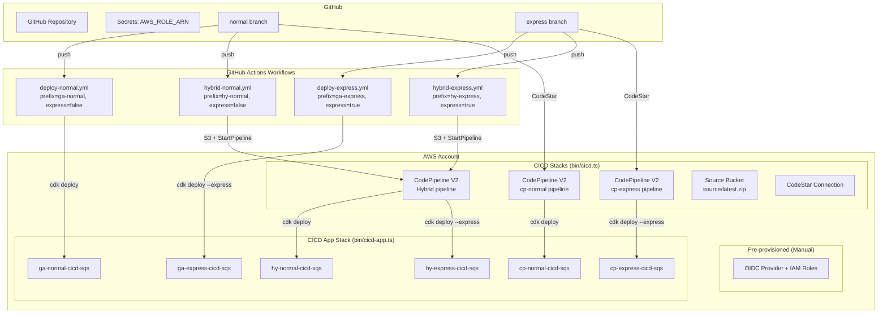
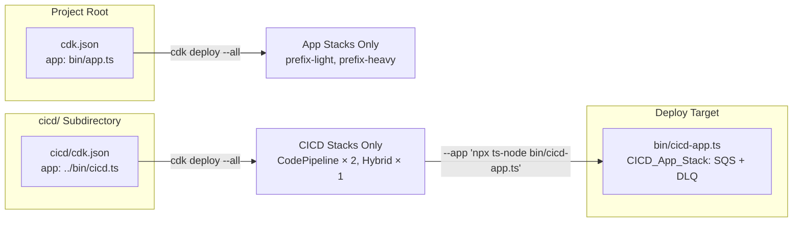
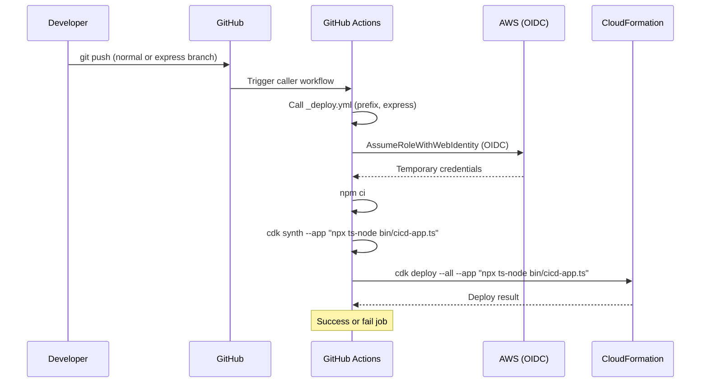
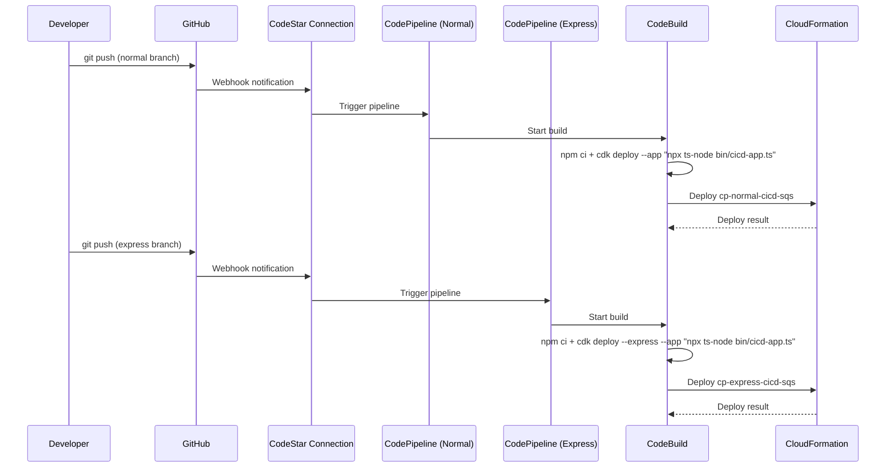
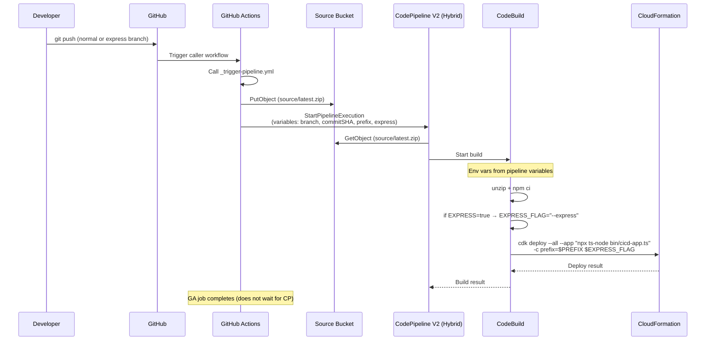

# Design Document: CI/CD Pipelines

## Overview

CDK Express Mode 検証プロジェクトに対して、3 パターンの CI/CD パイプラインを
アプリケーションスタックと完全に分離された独立 CDK スタックとして実装する。

- **GitHub Actions のみ**: AWS 側にパイプラインリソースを持たず、
  GitHub Actions ワークフロー内で直接 `cdk deploy` を実行する
- **CodePipeline V2 のみ**: CodeStar Connections で GitHub を接続し、
  AWS 側で完結するパイプラインを構築する（Normal / Express 各1本、計2本）
- **Hybrid（GitHub Actions + CodePipeline V2）**: GitHub Actions が
  トリガー＋ソース転送を担当し、CodePipeline V2 がデプロイを実行する（1本）

すべてのパイプラインのデプロイ対象は **CICD_App_Stack**（SQS + DLQ のみの最小スタック）とする。
`bin/cicd-app.ts` で定義され、`--app "npx ts-node bin/cicd-app.ts"` で参照する。
CI/CD パイプラインスタック自体は `bin/cicd.ts` という別エントリポイントから
合成・デプロイされ、既存の `bin/app.ts` ・ルートの `cdk.json` とは完全に独立する。

各パターンで `normal` ブランチと `express` ブランチを監視し、
合計 6 デプロイ（3 パターン × 2 モード）が名前衝突なく共存する。

## Architecture

### 高レベルアーキテクチャ



### CDK App 分離アーキテクチャ



プロジェクトルートの `cdk.json` は既存のまま変更しない。
CI/CD パイプラインスタックは `cicd/cdk.json` を使い分離する。
パイプラインがデプロイする対象は `bin/cicd-app.ts` の最小スタック。

### Prefix 方式と 6 デプロイの関係

| パターン | モード | Prefix | デプロイ対象スタック名 |
|---|---|---|---|
| GitHub Actions | Normal | `ga-normal` | `ga-normal-cicd-sqs` |
| GitHub Actions | Express | `ga-express` | `ga-express-cicd-sqs` |
| CodePipeline | Normal | `cp-normal` | `cp-normal-cicd-sqs` |
| CodePipeline | Express | `cp-express` | `cp-express-cicd-sqs` |
| Hybrid | Normal | `hy-normal` | `hy-normal-cicd-sqs` |
| Hybrid | Express | `hy-express` | `hy-express-cicd-sqs` |

## Components and Interfaces

### ディレクトリ構成

```text
cdk-express-mode/
├── bin/
│   ├── app.ts              # 既存: App_Stacks エントリポイント
│   ├── cicd.ts             # 新規: CICD_Stacks エントリポイント（パイプラインインフラ）
│   └── cicd-app.ts         # 新規: CICD_App_Stack エントリポイント（SQS + DLQ）
├── cicd/
│   └── cdk.json            # CICD 専用の CDK 設定
├── lib/
│   ├── naming.ts           # 既存: withPrefix ヘルパー
│   ├── light-stack.ts      # 既存
│   ├── heavy-stack.ts      # 既存
│   └── cicd/
│       ├── types.ts                  # Props 型定義
│       ├── codepipeline-stack.ts     # CodePipeline V2 Only（1インスタンス = 1パイプライン）
│       └── hybrid-stack.ts           # Hybrid パイプライン
├── .github/
│   └── workflows/
│       ├── _deploy.yml               # Reusable: CDK デプロイ
│       ├── _trigger-pipeline.yml     # Reusable: Hybrid トリガー
│       ├── deploy-normal.yml         # Caller: normal → _deploy.yml
│       ├── deploy-express.yml        # Caller: express → _deploy.yml
│       ├── hybrid-normal.yml         # Caller: normal → _trigger-pipeline.yml
│       └── hybrid-express.yml        # Caller: express → _trigger-pipeline.yml
├── cdk.json                # 既存: App_Stacks のみ
└── package.json
```

### 前提条件（手動事前設定）

以下は CDK スタックの対象外とし、手動で事前に作成する:

- **OIDC プロバイダー**: `token.actions.githubusercontent.com`
- **IAM ロール（Actions Only 用）**: CDK デプロイ権限を持つロール
- **IAM ロール（Hybrid 用）**: S3 PutObject + StartPipelineExecution
  権限のみを持つロール
- ロール ARN は GitHub リポジトリのシークレット `AWS_ROLE_ARN`
  （Actions Only）および `AWS_ROLE_ARN_HYBRID`（Hybrid）で参照

### コンポーネント一覧

| コンポーネント | ファイル | 責務 |
|---|---|---|
| CicdApp | `bin/cicd.ts` | CICD CDK App のエントリ。CodePipeline × 2 + Hybrid × 1 |
| CicdAppStack | `bin/cicd-app.ts` | デプロイ対象の最小スタック（SQS + DLQ） |
| CodePipelineStack | `lib/cicd/codepipeline-stack.ts` | CodePipeline V2 + CodeStar Source（1インスタンス1パイプライン） |
| HybridStack | `lib/cicd/hybrid-stack.ts` | Source Bucket + CodePipeline V2（S3 Source + Pipeline Variables） |
| `_deploy.yml` | `.github/workflows/` | Reusable: CDK デプロイワークフロー |
| `_trigger-pipeline.yml` | `.github/workflows/` | Reusable: Hybrid トリガーワークフロー |
| `deploy-normal.yml` | `.github/workflows/` | Caller: normal ブランチ → `_deploy.yml` |
| `deploy-express.yml` | `.github/workflows/` | Caller: express ブランチ → `_deploy.yml` |
| `hybrid-normal.yml` | `.github/workflows/` | Caller: normal ブランチ → `_trigger-pipeline.yml` |
| `hybrid-express.yml` | `.github/workflows/` | Caller: express ブランチ → `_trigger-pipeline.yml` |

### インターフェース定義

```typescript
// lib/cicd/types.ts

import { StackProps } from 'aws-cdk-lib';

/**
 * CI/CD スタック共通の Props。
 */
export interface CicdBaseProps extends StackProps {
  /** スタック名・物理名の衝突を避けるためのプレフィックス。 */
  readonly prefix: string;
  /** GitHub リポジトリオーナー。 */
  readonly githubOwner: string;
  /** GitHub リポジトリ名。 */
  readonly githubRepo: string;
}

/**
 * CodePipeline V2 Only スタックの Props。
 * 1 インスタンスで 1 パイプラインを作成する。normal / express で 2 回インスタンス化する。
 */
export interface CodePipelineStackProps extends CicdBaseProps {
  /** CodeStar Connections の ARN。 */
  readonly connectionArn: string;
  /** Express モードでデプロイするかどうか。 */
  readonly express: boolean;
  /** デプロイ対象のプレフィックス（例: 'cp-normal', 'cp-express'）。 */
  readonly deployPrefix: string;
  /** 監視対象のブランチ名。 */
  readonly branch: string;
}

/**
 * Hybrid（GitHub Actions + CodePipeline V2）スタックの Props。
 * Pipeline Variables で mode を動的に切り替えるため、express/branch は Props に含まない。
 */
export interface HybridStackProps extends CicdBaseProps {
  // Pipeline Variables (prefix, express, branch, commitSHA) で動的に切り替え
}
```

### Pattern 1: GitHub Actions Only（Reusable Workflow）



#### `_deploy.yml`（Reusable Workflow）

```yaml
on:
  workflow_call:
    inputs:
      prefix:
        required: true
        type: string
      express:
        required: false
        type: boolean
        default: false
    secrets:
      AWS_ROLE_ARN:
        required: true
```

主要コマンド:

```bash
npx cdk synth --app "npx ts-node bin/cicd-app.ts" \
  -c prefix=$PREFIX $EXPRESS_FLAG
npx cdk deploy --all --app "npx ts-node bin/cicd-app.ts" \
  -c prefix=$PREFIX --require-approval never $EXPRESS_FLAG
```

#### Caller Workflows

| ワークフロー | トリガー | `prefix` | `express` |
|---|---|---|---|
| `deploy-normal.yml` | push to `normal` | `ga-normal` | `false` |
| `deploy-express.yml` | push to `express` | `ga-express` | `true` |

### Pattern 2: CodePipeline V2 Only（2 パイプライン）



`CodePipelineStack` を 2 回インスタンス化して 2 本のパイプラインを作成する:

- `${prefix}-cicd-codepipeline-normal`: `normal` ブランチを監視、`--express` なし
- `${prefix}-cicd-codepipeline-express`: `express` ブランチを監視、`--express` あり

buildspec のデプロイコマンド:

```bash
# Normal pipeline
npx cdk deploy --all --app "npx ts-node bin/cicd-app.ts" \
  -c prefix=cp-normal --require-approval never

# Express pipeline
npx cdk deploy --all --app "npx ts-node bin/cicd-app.ts" \
  -c prefix=cp-express --require-approval never --express
```

### Pattern 3: Hybrid（GitHub Actions + CodePipeline V2）



#### `_trigger-pipeline.yml`（Reusable Workflow）

```yaml
on:
  workflow_call:
    inputs:
      prefix:
        required: true
        type: string
      express:
        required: true
        type: boolean
      source-bucket:
        required: true
        type: string
      pipeline-name:
        required: true
        type: string
    secrets:
      AWS_ROLE_ARN:
        required: true
```

主要ステップ:

1. Checkout
2. Configure AWS credentials (OIDC)
3. `zip -r source.zip . -x '.git/*'`
4. `aws s3 cp source.zip s3://${source-bucket}/source/latest.zip`
5. `aws codepipeline start-pipeline-execution` with variables

#### Caller Workflows

| ワークフロー | トリガー | `prefix` | `express` |
|---|---|---|---|
| `hybrid-normal.yml` | push to `normal` | `hy-normal` | `false` |
| `hybrid-express.yml` | push to `express` | `hy-express` | `true` |

#### Hybrid Pipeline の CodeBuild buildspec

```yaml
version: '0.2'
phases:
  install:
    runtime-versions:
      nodejs: '20'
    commands:
      - npm ci
  build:
    commands:
      - |
        if [ "$EXPRESS" = "true" ]; then
          EXPRESS_FLAG="--express"
        else
          EXPRESS_FLAG=""
        fi
      - >
        npx cdk deploy --all
        --app "npx ts-node bin/cicd-app.ts"
        -c prefix=$PREFIX
        --require-approval never
        $EXPRESS_FLAG
```

環境変数は Pipeline Variables から注入:

- `BRANCH` ← `branch` 変数
- `COMMIT_SHA` ← `commitSHA` 変数
- `PREFIX` ← `prefix` 変数
- `EXPRESS` ← `express` 変数（`"true"` or `"false"`）

## Data Models

### CICD_App_Stack（`bin/cicd-app.ts`）

```typescript
#!/usr/bin/env node
import * as cdk from 'aws-cdk-lib';
import * as sqs from 'aws-cdk-lib/aws-sqs';
import { Construct } from 'constructs';

class CicdSqsStack extends cdk.Stack {
  constructor(scope: Construct, id: string, props?: cdk.StackProps) {
    super(scope, id, props);
    const dlq = new sqs.Queue(this, 'Dlq', { enforceSSL: true });
    new sqs.Queue(this, 'Main', {
      enforceSSL: true,
      deadLetterQueue: { queue: dlq, maxReceiveCount: 3 },
    });
  }
}

const app = new cdk.App();
const prefix: string = app.node.tryGetContext('prefix') ?? 'dev';
new CicdSqsStack(app, `${prefix}-cicd-sqs`, {
  env: {
    account: process.env.CDK_DEFAULT_ACCOUNT,
    region: process.env.CDK_DEFAULT_REGION ?? 'ap-northeast-1',
  },
});
```

### CDK Construct 構造（`bin/cicd.ts`）

```typescript
#!/usr/bin/env node
import * as cdk from 'aws-cdk-lib';
import { Aspects } from 'aws-cdk-lib';
import { AwsSolutionsChecks } from 'cdk-nag';
import { withPrefix } from '../lib/naming';
import { CodePipelineStack } from '../lib/cicd/codepipeline-stack';
import { HybridStack } from '../lib/cicd/hybrid-stack';

const app = new cdk.App();

const prefix: string = app.node.tryGetContext('prefix') ?? 'dev';
const githubOwner: string = app.node.tryGetContext('githubOwner');
const githubRepo: string = app.node.tryGetContext('githubRepo');
const normalBranch: string = app.node.tryGetContext('normalBranch') ?? 'normal';
const expressBranch: string = app.node.tryGetContext('expressBranch') ?? 'express';
const connectionArn: string = app.node.tryGetContext('connectionArn') ?? '';

const env: cdk.Environment = {
  account: process.env.CDK_DEFAULT_ACCOUNT,
  region: process.env.CDK_DEFAULT_REGION ?? 'ap-northeast-1',
};

// CodePipeline V2 Only — Normal mode
new CodePipelineStack(app, withPrefix(prefix, 'cicd-codepipeline-normal'), {
  env,
  prefix,
  githubOwner,
  githubRepo,
  connectionArn,
  express: false,
  deployPrefix: 'cp-normal',
  branch: normalBranch,
});

// CodePipeline V2 Only — Express mode
new CodePipelineStack(app, withPrefix(prefix, 'cicd-codepipeline-express'), {
  env,
  prefix,
  githubOwner,
  githubRepo,
  connectionArn,
  express: true,
  deployPrefix: 'cp-express',
  branch: expressBranch,
});

// Hybrid（GitHub Actions + CodePipeline V2）— 1 pipeline with variable-based dispatch
new HybridStack(app, withPrefix(prefix, 'cicd-hybrid'), {
  env,
  prefix,
  githubOwner,
  githubRepo,
});

Aspects.of(app).add(new AwsSolutionsChecks({ verbose: true }));
```

### CodePipelineStack リソース構成（1 インスタンスあたり）

| リソース | 説明 |
|---|---|
| CodePipeline V2 | `PipelineType.V2`、`${prefix}-cicd-codepipeline-{normal\|express}` |
| Source Action | CodeStar Connections ソース（branch 指定） |
| Build Project | CodeBuild (npm ci + cdk deploy --app "npx ts-node bin/cicd-app.ts") |
| Artifact Bucket | パイプラインアーティファクト用 S3 |
| Pipeline Role | パイプライン実行ロール |
| CodeBuild Role | ビルド＋デプロイ権限（CDK bootstrap ロール AssumeRole） |

buildspec の `cdk deploy` コマンドで `deployPrefix` と `express` フラグを使い分ける。

### HybridStack リソース構成

| リソース | 説明 |
|---|---|
| Source Bucket | `source/latest.zip` を格納 |
| CodePipeline V2 | S3 Source（polling 無効）、`${prefix}-cicd-hybrid` |
| Build Project | CodeBuild (npm ci + 条件付き cdk deploy) |
| Artifact Bucket | パイプラインアーティファクト用 S3 |
| Pipeline Role | パイプライン実行ロール |
| CodeBuild Role | ビルド＋デプロイ権限 |
| Pipeline Variables | `branch`, `commitSHA`, `prefix`, `express` |

Note: Hybrid 用の OIDC ロール（S3 PutObject + StartPipelineExecution）は
手動で事前作成する。GitHub シークレット `AWS_ROLE_ARN_HYBRID` で参照する。

### Pipeline Variables（Hybrid パターン）

CodePipeline V2 のパイプライン変数として以下を定義する:

| 変数名 | 型 | 用途 |
|---|---|---|
| `branch` | string | トリガー元のブランチ名 |
| `commitSHA` | string | トリガー元のコミット SHA |
| `prefix` | string | デプロイ対象の CDK context prefix |
| `express` | string | `"true"` or `"false"`。`--express` フラグの有無を制御 |

GitHub Actions の `StartPipelineExecution` API コール時に渡し、
CodeBuild 環境変数として利用可能にする。

### IAM ロール設計

```mermaid
graph TD
    subgraph "Pre-provisioned (Manual)"
        OIDC_DEPLOY[OIDC Role: deploy<br/>GitHub Secret: AWS_ROLE_ARN<br/>cfn:*, s3:PutObject assets,<br/>iam:PassRole to CDK exec role]
        OIDC_HYBRID[OIDC Role: hybrid-trigger<br/>GitHub Secret: AWS_ROLE_ARN_HYBRID<br/>s3:PutObject source bucket,<br/>codepipeline:StartPipelineExecution]
    end

    subgraph "CICD Stacks (CDK-managed)"
        CP_ROLE_N[Pipeline Role (Normal)<br/>codebuild:StartBuild,<br/>s3:GetObject/PutObject artifacts]
        CP_ROLE_E[Pipeline Role (Express)<br/>codebuild:StartBuild,<br/>s3:GetObject/PutObject artifacts]
        CB_CP_N[CodeBuild Role: cp-normal<br/>sts:AssumeRole cdk-*,<br/>cfn:*, s3:PutObject assets]
        CB_CP_E[CodeBuild Role: cp-express<br/>sts:AssumeRole cdk-*,<br/>cfn:*, s3:PutObject assets]
        HY_PIPE_ROLE[Pipeline Role (Hybrid)<br/>codebuild:StartBuild,<br/>s3:GetObject/PutObject]
        CB_HYBRID[CodeBuild Role: hybrid<br/>sts:AssumeRole cdk-*,<br/>cfn:*, s3:PutObject assets]
    end
```

#### OIDC 信頼ポリシー（手動作成時の参考）

```json
{
  "Effect": "Allow",
  "Principal": {
    "Federated": "arn:aws:iam::<account>:oidc-provider/token.actions.githubusercontent.com"
  },
  "Action": "sts:AssumeRoleWithWebIdentity",
  "Condition": {
    "StringEquals": {
      "token.actions.githubusercontent.com:aud": "sts.amazonaws.com"
    },
    "StringLike": {
      "token.actions.githubusercontent.com:sub":
        "repo:<owner>/<repo>:ref:refs/heads/*"
    }
  }
}
```

### `cicd/cdk.json` 構成

```json
{
  "app": "npx ts-node --prefer-ts-exts ../bin/cicd.ts",
  "context": {
    "githubOwner": "OWNER",
    "githubRepo": "cdk-express-mode",
    "normalBranch": "normal",
    "expressBranch": "express",
    "connectionArn": ""
  }
}
```

開発者は `cicd/` ディレクトリで `cdk deploy --all` を実行するか、
プロジェクトルートから
`cdk --app "npx ts-node bin/cicd.ts" deploy --all` を実行する。

## Error Handling

### GitHub Actions ワークフロー

| 失敗ポイント | 対処 |
|---|---|
| OIDC AssumeRole 失敗 | ジョブ即失敗。IAM 設定のエラーメッセージを出力 |
| `npm ci` 失敗 | ジョブ即失敗。依存関係エラーを出力 |
| `cdk synth` 失敗 | deploy ステップに進まず即失敗 |
| `cdk deploy` 失敗 | 非ゼロ exit code でジョブ失敗 |
| S3 PutObject 失敗（Hybrid） | ジョブ即失敗 |
| StartPipelineExecution 失敗（Hybrid） | ジョブ即失敗 |
| タイムアウト（30 分） | ジョブ強制終了 |

### CodePipeline V2

| 失敗ポイント | 対処 |
|---|---|
| Source 取得失敗 | パイプライン実行 FAILED |
| CodeBuild ビルド失敗 | パイプライン実行 FAILED |
| `cdk deploy` 失敗 | CodeBuild 非ゼロ exit → パイプライン FAILED |
| CodeBuild タイムアウト | 30 分（buildspec で制限） |

### CDK デプロイ失敗時の考慮

- Express Mode はロールバックがデフォルト無効のため、デプロイ失敗時に
  中途半端な状態が残る可能性がある
- CI/CD パイプラインの buildspec では `--no-rollback` を明示しない
  （Express Mode 使用時は CDK 側でロールバック無効が自動適用される）
- 失敗時はスタックイベントを確認し、必要に応じて手動で削除・再デプロイする

## Testing Strategy

### テスト方針

本機能は CDK による IaC（Infrastructure as Code）であり、
テスト対象はデプロイされる CloudFormation テンプレートの正しさとなる。
Property-Based Testing は IaC に適さないため使用せず、
CDK スナップショットテストとアサーションベースのユニットテストで検証する。

PBT が適さない理由:

- CDK スタックは宣言的な設定であり、入出力の関数ではない
- テンプレートの正しさはリソースの存在・プロパティの値で決まる（入力空間が狭い）
- スナップショットテストと `Template.hasResourceProperties` で十分検証可能

### ユニットテスト（Jest + CDK Assertions）

各 CICD スタックについて以下を検証する:

#### CicdSqsStack（CICD_App_Stack）テスト

- SQS Queue が 2 つ（Main + DLQ）作成される
- 両方の Queue に `enforceSSL: true` が設定される
- DLQ が Main Queue の DeadLetterQueue として設定される
- スタック名が `${prefix}-cicd-sqs` パターンに従う

#### CodePipelineStack テスト（Normal / Express 共通）

- CodePipeline が V2 タイプで作成される
- Source Action が CodeStarSourceConnection を使用し、正しいブランチを監視する
- CodeBuild プロジェクトが存在し、`--app "npx ts-node bin/cicd-app.ts"` を含む
  buildspec を持つ
- Normal パイプラインの buildspec に `--express` が含まれない
- Express パイプラインの buildspec に `--express` が含まれる
- buildspec に正しい `deployPrefix` が使用される
- 各ステージに別々の IAM Role が割り当てられている

#### HybridStack テスト

- Source Bucket が作成される
- CodePipeline が V2 タイプで S3 Source Action を使用する
- S3 Source Action の polling/event trigger が無効
- Pipeline Variables（branch, commitSHA, prefix, express）が定義されている
- CodeBuild の buildspec が条件付き `--express` ロジックを含む
- CodeBuild の buildspec に `--app "npx ts-node bin/cicd-app.ts"` が含まれる
- OIDC Role は CDK 管理外のため存在チェックは行わない

#### 命名規約テスト

- 全スタック名が `${prefix}-cicd-${type}` パターンに従う
- `withPrefix` が正しく適用されている
- CodePipeline スタックが `codepipeline-normal` / `codepipeline-express` を含む

### スナップショットテスト

- 各スタックの合成テンプレートのスナップショットを保持し、
  意図しない変更を検出する

### cdk-nag 検証

- `AwsSolutionsChecks` を CICD スタックにも適用
- テスト内で cdk-nag の警告・エラーがゼロであることを検証
- 検証目的で緩和が必要な項目は `NagSuppressions` で理由を明記

### インテグレーションテスト（手動）

- 実際に CICD スタックをデプロイし、各パイプラインが正常に動作することを
  手動で検証する
- GitHub Actions ワークフローのトリガー確認
  （normal/express 両ブランチ）
- CodePipeline の実行確認（2 本が独立に動作する）
- Hybrid パターンの S3 アップロード → パイプライン起動の確認
  （Pipeline Variables で prefix/express が正しく渡される）
- 6 デプロイすべてが名前衝突なく共存できることを確認
