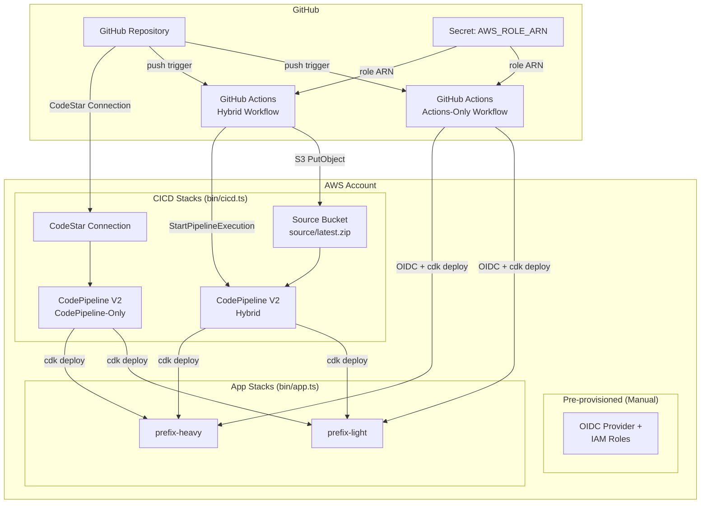
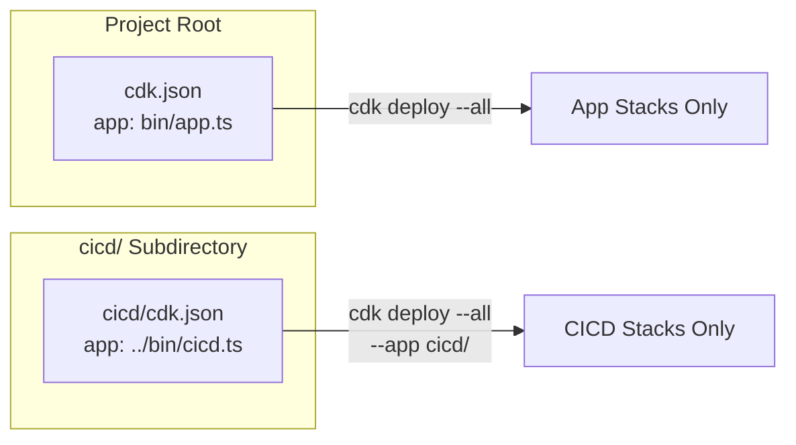
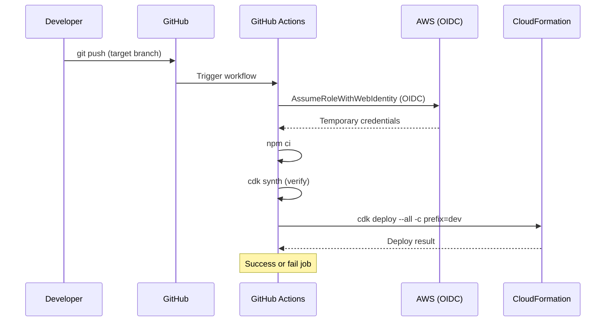
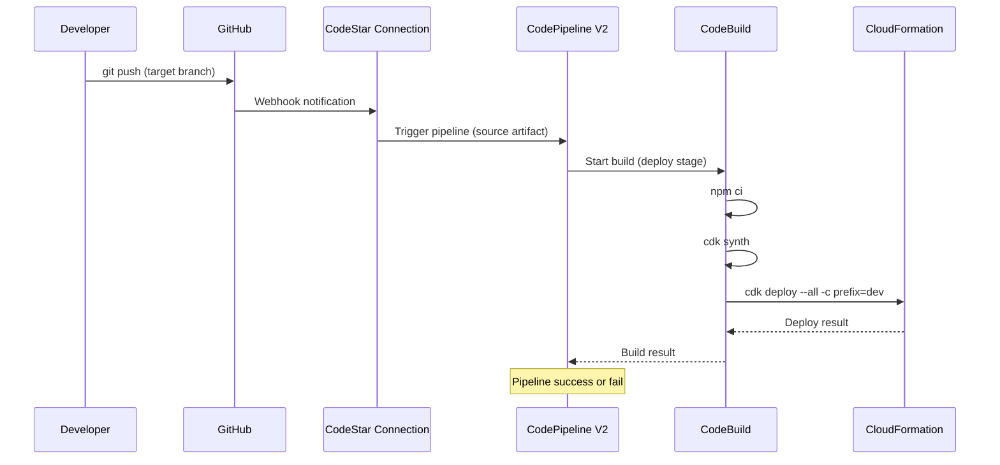
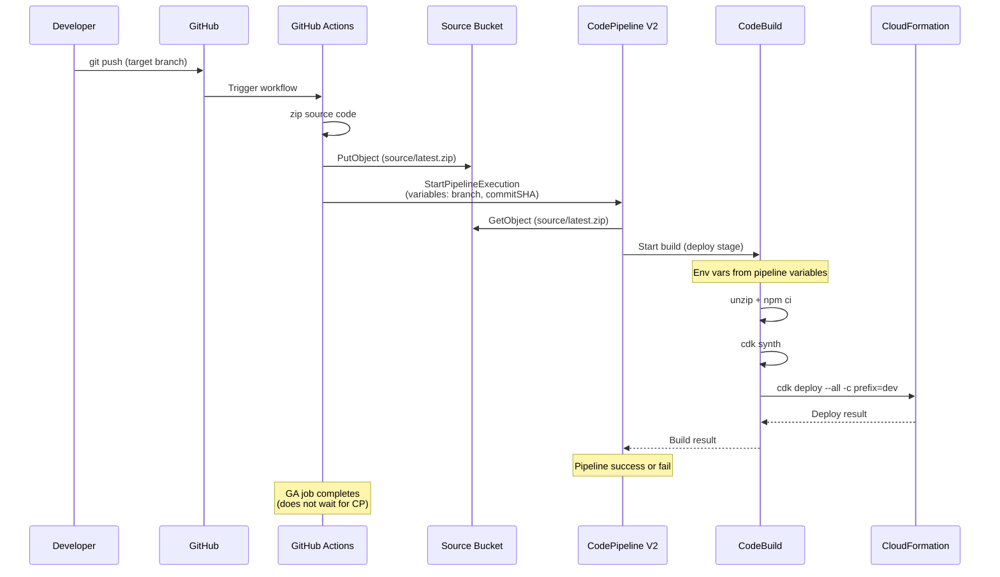
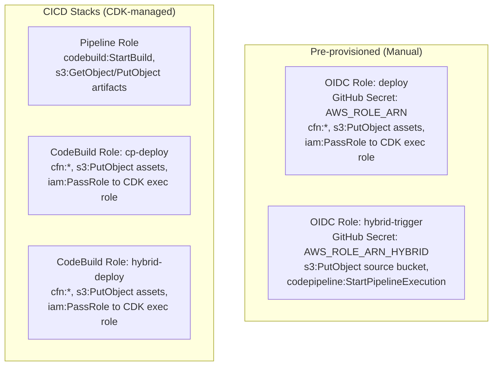

# Design Document: CI/CD Pipelines

## Overview

CDK Express Mode 検証プロジェクトに対して、3 パターンの CI/CD パイプラインを
アプリケーションスタックと完全に分離された独立 CDK スタックとして実装する。

- **GitHub Actions のみ**: AWS 側にパイプラインリソースを持たず、
  GitHub Actions ワークフロー内で直接 `cdk deploy` を実行する
- **CodePipeline V2 のみ**: CodeStar Connections で GitHub を接続し、
  AWS 側で完結するパイプラインを構築する
- **Hybrid（GitHub Actions + CodePipeline V2）**: GitHub Actions が
  トリガー＋ソース転送を担当し、CodePipeline V2 がデプロイを実行する

3 パターンすべて、同一の App_Stacks（`${prefix}-light`, `${prefix}-heavy`）を
デプロイ対象とする。CI/CD スタック自体は `bin/cicd.ts` という別エントリポイントから
合成・デプロイされ、既存の `bin/app.ts` ・ルートの `cdk.json` とは完全に独立する。

## Architecture

### 高レベルアーキテクチャ



### CDK App 分離アーキテクチャ



プロジェクトルートの `cdk.json` は既存のまま変更しない。
CI/CD スタックは `cicd/cdk.json` を使い、`--app` 引数または
`cicd/` ディレクトリで実行する方式で分離する。

## Components and Interfaces

### ディレクトリ構成

```text
cdk-express-mode/
├── bin/
│   ├── app.ts              # 既存: App_Stacks エントリポイント
│   └── cicd.ts             # 新規: CICD_Stacks エントリポイント
├── cicd/
│   └── cdk.json            # CICD 専用の CDK 設定
├── lib/
│   ├── naming.ts           # 既存: withPrefix ヘルパー
│   ├── light-stack.ts      # 既存
│   ├── heavy-stack.ts      # 既存
│   └── cicd/
│       ├── codepipeline-stack.ts     # CodePipeline V2 Only
│       └── hybrid-stack.ts           # Hybrid パイプライン
├── .github/
│   └── workflows/
│       ├── deploy-actions.yml        # GitHub Actions Only
│       └── deploy-hybrid.yml         # Hybrid トリガー
├── cdk.json                # 既存: App_Stacks のみ
└── package.json
```

### 前提条件（手動事前設定）

以下は CDK スタックの対象外とし、手動で事前に作成する:

- **OIDC プロバイダー**: `token.actions.githubusercontent.com`
- **IAM ロール（Actions Only 用）**: CDK デプロイ権限を持つロール
- **IAM ロール（Hybrid 用）**: S3 PutObject + StartPipelineExecution
  権限のみを持つロール
- ロール ARN は GitHub リポジトリのシークレット `AWS_ROLE_ARN`
  （Actions Only）および `AWS_ROLE_ARN_HYBRID`（Hybrid）で参照

### コンポーネント一覧

| コンポーネント | ファイル | 責務 |
|---|---|---|
| CicdApp | `bin/cicd.ts` | CICD CDK App のエントリ。prefix を context から取得 |
| CodePipelineStack | `lib/cicd/codepipeline-stack.ts` | CodePipeline V2 + CodeStar Source |
| HybridStack | `lib/cicd/hybrid-stack.ts` | Source Bucket + CodePipeline V2（S3 Source） |
| deploy-actions.yml | `.github/workflows/` | GitHub Actions Only ワークフロー |
| deploy-hybrid.yml | `.github/workflows/` | Hybrid ワークフロー（S3 + StartPipeline） |

### インターフェース定義

```typescript
// bin/cicd.ts のエントリポイント構成
interface CicdAppContext {
  prefix: string;         // CDK context から取得、fallback: 'dev'
  githubOwner: string;    // GitHub リポジトリオーナー
  githubRepo: string;     // GitHub リポジトリ名
  githubBranch: string;   // トリガー対象ブランチ、fallback: 'main'
  connectionArn?: string; // CodeStar Connection ARN（CodePipeline Only 用）
}

// 各スタックの Props
interface CicdBaseProps extends StackProps {
  readonly prefix: string;
  readonly githubOwner: string;
  readonly githubRepo: string;
  readonly githubBranch: string;
}

interface CodePipelineStackProps extends CicdBaseProps {
  readonly connectionArn: string;
}

interface HybridStackProps extends CicdBaseProps {
  // Source Bucket はスタック内で作成するため追加 props 不要
}
```

#### Pattern 1: GitHub Actions Only



#### Pattern 2: CodePipeline V2 Only



#### Pattern 3: Hybrid (GitHub Actions + CodePipeline V2)



## Data Models

### CDK Construct 構造

#### `bin/cicd.ts`

```typescript
const app = new cdk.App();
const prefix: string = app.node.tryGetContext('prefix') ?? 'dev';
const githubOwner: string = app.node.tryGetContext('githubOwner');
const githubRepo: string = app.node.tryGetContext('githubRepo');
const githubBranch: string = app.node.tryGetContext('githubBranch') ?? 'main';
const connectionArn: string = app.node.tryGetContext('connectionArn') ?? '';

const env: cdk.Environment = {
  account: process.env.CDK_DEFAULT_ACCOUNT,
  region: process.env.CDK_DEFAULT_REGION ?? 'ap-northeast-1',
};

// Stack naming: ${prefix}-cicd-${type}
// Note: GitHub Actions Only pattern does not require a CDK stack
// (OIDC roles are pre-provisioned manually)

new CodePipelineStack(app, withPrefix(prefix, 'cicd-codepipeline'), {
  env, prefix, githubOwner, githubRepo, githubBranch, connectionArn,
});

new HybridStack(app, withPrefix(prefix, 'cicd-hybrid'), {
  env, prefix, githubOwner, githubRepo, githubBranch,
});
```

#### GitHubActionsStack（なし — OIDC は手動事前設定）

GitHub Actions Only パターンは CDK スタックを持たない。
OIDC プロバイダーと IAM ロールは手動で事前作成し、
ロール ARN を GitHub シークレット `AWS_ROLE_ARN` で参照する。

#### CodePipelineStack リソース構成

| リソース | 説明 |
|---|---|
| CodePipeline V2 | `PipelineType.V2` |
| Source Action | CodeStar Connections ソース |
| Build Project | CodeBuild (npm ci + cdk deploy) |
| Artifact Bucket | パイプラインアーティファクト用 S3 |
| Pipeline Role | パイプライン実行ロール |
| CodeBuild Role | ビルド＋デプロイ権限 |

#### HybridStack リソース構成

| リソース | 説明 |
|---|---|
| Source Bucket | `source/latest.zip` を格納 |
| CodePipeline V2 | S3 Source（polling 無効） |
| Build Project | CodeBuild (npm ci + cdk deploy) |
| Artifact Bucket | パイプラインアーティファクト用 S3 |
| Pipeline Role | パイプライン実行ロール |
| CodeBuild Role | ビルド＋デプロイ権限 |
| Pipeline Variables | branch, commitSHA |

Note: Hybrid 用の OIDC ロール（S3 PutObject + StartPipelineExecution）は
手動で事前作成する。GitHub シークレット `AWS_ROLE_ARN_HYBRID` で参照する。

### Pipeline Variables（Hybrid パターン）

CodePipeline V2 のパイプライン変数として以下を定義する:

| 変数名 | 型 | 用途 |
|---|---|---|
| `branch` | string | トリガー元のブランチ名 |
| `commitSHA` | string | トリガー元のコミット SHA |

GitHub Actions から `StartPipelineExecution` API コール時に渡し、
CodeBuild 環境変数として利用可能にする。

### IAM ロール設計



#### OIDC 信頼ポリシー（手動作成時の参考）

OIDC ロールは CDK 管理外だが、設定すべき信頼ポリシーを参考として記載:

```json
{
  "Effect": "Allow",
  "Principal": {
    "Federated": "arn:aws:iam::<account>:oidc-provider/token.actions.githubusercontent.com"
  },
  "Action": "sts:AssumeRoleWithWebIdentity",
  "Condition": {
    "StringEquals": {
      "token.actions.githubusercontent.com:aud": "sts.amazonaws.com"
    },
    "StringLike": {
      "token.actions.githubusercontent.com:sub":
        "repo:<owner>/<repo>:ref:refs/heads/<branch>"
    }
  }
}
```

### `cicd/cdk.json` 構成

```json
{
  "app": "npx ts-node --prefer-ts-exts ../bin/cicd.ts",
  "context": {
    "githubOwner": "OWNER",
    "githubRepo": "cdk-express-mode",
    "githubBranch": "main",
    "connectionArn": ""
  }
}
```

開発者は `cicd/` ディレクトリで `cdk deploy --all` を実行するか、
プロジェクトルートから `cdk --app "npx ts-node bin/cicd.ts" deploy --all` を実行する。

## Error Handling

### GitHub Actions ワークフロー

| 失敗ポイント | 対処 |
|---|---|
| OIDC AssumeRole 失敗 | ジョブ即失敗。IAM 設定のエラーメッセージを出力 |
| `npm ci` 失敗 | ジョブ即失敗。依存関係エラーを出力 |
| `cdk synth` 失敗 | deploy ステップに進まず即失敗 |
| `cdk deploy` 失敗 | 非ゼロ exit code でジョブ失敗 |
| S3 PutObject 失敗（Hybrid） | ジョブ即失敗 |
| StartPipelineExecution 失敗（Hybrid） | ジョブ即失敗 |
| タイムアウト（30 分） | ジョブ強制終了 |

### CodePipeline V2

| 失敗ポイント | 対処 |
|---|---|
| Source 取得失敗 | パイプライン実行 FAILED |
| CodeBuild ビルド失敗 | パイプライン実行 FAILED |
| `cdk deploy` 失敗 | CodeBuild 非ゼロ exit → パイプライン FAILED |
| CodeBuild タイムアウト | デフォルト 60 分。buildspec で制限設定可能 |

### CDK デプロイ失敗時の考慮

- Express Mode はロールバックがデフォルト無効のため、デプロイ失敗時に
  中途半端な状態が残る可能性がある
- CI/CD パイプラインの buildspec では `--no-rollback` を明示しない
  （Express Mode 使用時は CDK 側でロールバック無効が自動適用される）
- 失敗時はスタックイベントを確認し、必要に応じて手動で削除・再デプロイする

## Testing Strategy

### テスト方針

本機能は CDK による IaC（Infrastructure as Code）であり、
テスト対象はデプロイされる CloudFormation テンプレートの正しさとなる。
Property-Based Testing は IaC に適さないため使用せず、
CDK スナップショットテストとアサーションベースのユニットテストで検証する。

PBT が適さない理由:

- CDK スタックは宣言的な設定であり、入出力の関数ではない
- テンプレートの正しさはリソースの存在・プロパティの値で決まる（入力空間が狭い）
- スナップショットテストと `Template.hasResourceProperties` で十分検証可能

### ユニットテスト（Jest + CDK Assertions）

各 CICD スタックについて以下を検証する:

#### CodePipelineStack テスト

- CodePipeline が V2 タイプで作成される
- Source Action が CodeStarSourceConnection を使用する
- CodeBuild プロジェクトが存在し、適切な buildspec を持つ
- 各ステージに別々の IAM Role が割り当てられている

#### HybridStack テスト

- Source Bucket が作成される
- CodePipeline が V2 タイプで S3 Source Action を使用する
- S3 Source Action の polling/event trigger が無効
- Pipeline Variables（branch, commitSHA）が定義されている
- OIDC Role は CDK 管理外のため存在チェックは行わない

#### 命名規約テスト

- 全スタック名が `${prefix}-cicd-${type}` パターンに従う
- `withPrefix` が正しく適用されている

### スナップショットテスト

- 各スタックの合成テンプレートのスナップショットを保持し、
  意図しない変更を検出する

### cdk-nag 検証

- `AwsSolutionsChecks` を CICD スタックにも適用
- テスト内で cdk-nag の警告・エラーがゼロであることを検証
- 検証目的で緩和が必要な項目は `NagSuppressions` で理由を明記

### インテグレーションテスト（手動）

- 実際に CICD スタックをデプロイし、各パイプラインが正常に動作することを
  手動で検証する
- GitHub Actions ワークフローのトリガー確認
- CodePipeline の実行確認
- Hybrid パターンの S3 アップロード → パイプライン起動の確認

